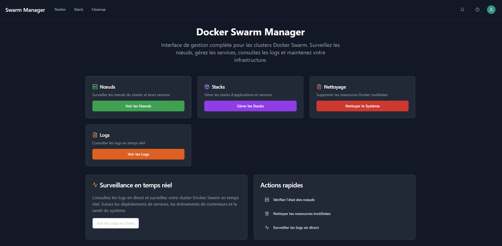
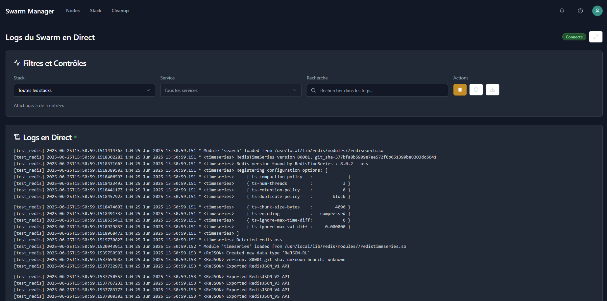
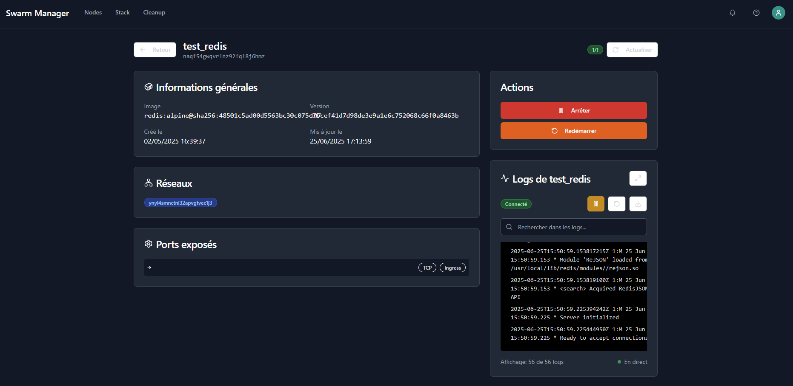
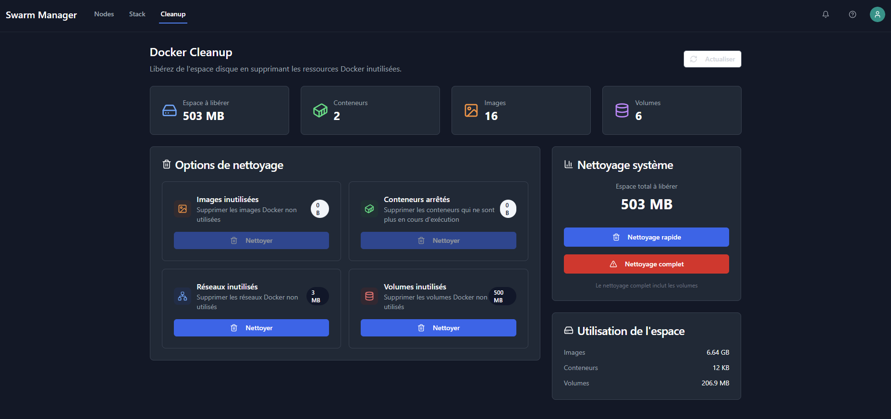

# 🐳 Swarm Manager

[](https://www.docker.com/)
[](https://golang.org/)
[](https://reactjs.org/)
[](https://www.typescriptlang.org/)
[](https://tailwindcss.com/)

[](https://opensource.org/licenses/MIT)
[](https://goreportcard.com/report/github.com/Affell/swarm-manager/backend)
[](https://github.com/Affell/swarm-manager/pkgs/container/swarm-manager)

A modern, real-time Docker Swarm management interface with comprehensive monitoring, logging, and cleanup capabilities.



## ✨ Features

### 🎯 Core Management

- **Real-time Node Monitoring** - Live status updates and resource usage
- **Stack Management** - Deploy, update, and remove Docker stacks
- **Service Details** - Comprehensive service information and control
- **Advanced Cleanup** - Smart cleanup with size estimation and confirmation

### 📊 Live Monitoring

- **Global Swarm Logs** - Real-time log streaming from all services
- **Service-specific Logs** - Focused log viewing with filtering
- **WebSocket Integration** - Live updates without page refresh
- **Search & Filter** - Local client-side log filtering for performance

### 🎨 Modern UI/UX

- **Responsive Design** - Works on desktop, tablet, and mobile
- **Dark Theme** - Easy on the eyes with modern styling
- **Full-screen Views** - Expandable log viewers with controls
- **Download Logs** - Export logs for offline analysis
- **Pause/Resume** - Control log streaming as needed

## 🚀 Quick Start

### Using Docker Compose

```bash
# Clone the repository
git clone https://github.com/Affell/swarm-manager.git
cd swarm-manager

# Start the application
docker-compose up -d
```

### Using Docker Stack

```bash
# Deploy to Docker Swarm
docker stack deploy -c docker-stack.yml swarm-manager
```

### From Source

```bash
# Backend (Go)
cd backend
go mod download
go run main.go

# Frontend (React + TypeScript)
cd frontend
npm install
npm run dev
```

## 📋 Prerequisites

- Docker Engine 20.10+ with Swarm mode enabled
- Docker Compose 2.0+ (for docker-compose deployment)
- Go 1.21+ (for development)
- Node.js 18+ (for frontend development)

## 🛠️ Configuration

### Environment Variables

| Variable      | Default                       | Description                              |
| ------------- | ----------------------------- | ---------------------------------------- |
| `PORT`        | `5000`                        | HTTP server port                         |
| `DOCKER_HOST` | `unix:///var/run/docker.sock` | Docker daemon socket                     |
| `LOG_LEVEL`   | `info`                        | Logging level (debug, info, warn, error) |

### Docker Socket Access

The application requires access to the Docker socket to manage the swarm:

```yaml
volumes:
  - /var/run/docker.sock:/var/run/docker.sock:ro
```

## 📚 API Documentation

### REST Endpoints

| Method | Endpoint                   | Description                   |
| ------ | -------------------------- | ----------------------------- |
| `GET`  | `/api/nodes`               | List all swarm nodes          |
| `GET`  | `/api/stacks`              | List all deployed stacks      |
| `GET`  | `/api/services`            | List all services             |
| `GET`  | `/api/nodes/{id}/services` | Get services on specific node |
| `GET`  | `/api/services/{id}`       | Get service details           |
| `POST` | `/api/cleanup/estimate`    | Estimate cleanup size         |
| `POST` | `/api/cleanup/prune`       | Execute cleanup               |
| `GET`  | `/api/system/info`         | Get system information        |

### WebSocket Endpoints

| Endpoint                  | Description                  |
| ------------------------- | ---------------------------- |
| `/api/logs/swarm`         | Global swarm logs stream     |
| `/api/services/{id}/logs` | Service-specific logs stream |

## 🏗️ Architecture

```
┌─────────────────┐    ┌─────────────────┐    ┌─────────────────┐
│   React UI      │    │   Go Backend    │    │  Docker Swarm   │
│  (TypeScript)   │◄──►│   (REST API)    │◄──►│   (Services)    │
│                 │    │                 │    │                 │
│  - Real-time UI │    │  - WebSocket    │    │  - Nodes        │
│  - Log Viewer   │    │  - Docker API   │    │  - Services     │
│  - Management   │    │  - Log Stream   │    │  - Stacks       │
└─────────────────┘    └─────────────────┘    └─────────────────┘
```

### Tech Stack

**Backend:**

- Go 1.21+ with Gorilla Mux
- Docker API client
- WebSocket for real-time logs
- CORS-enabled REST API

**Frontend:**

- React 18 with TypeScript
- Vite for development and building
- TailwindCSS + Radix UI components
- React Query for state management
- Custom WebSocket hooks

## 🔧 Development

### Backend Development

```bash
cd backend
go mod tidy
go run main.go
```

### Frontend Development

```bash
cd frontend
npm install
npm run dev
```

### Building for Production

```bash
# Backend binary
cd backend
CGO_ENABLED=0 GOOS=linux go build -a -installsuffix cgo -o swarm-manager .

# Frontend assets
cd frontend
npm run build
```

## 🐳 Docker Build

```bash
# Build the image
docker build -t swarm-manager .

# Run the container
docker run -d \
  -p 5000:5000 \
  -v /var/run/docker.sock:/var/run/docker.sock:ro \
  --name swarm-manager \
  swarm-manager
```

## 📊 Screenshots

### Live Logs Viewer



### Service Management



### Cleanup



## 🤝 Contributing

1. Fork the repository
2. Create a feature branch (`git checkout -b feature/amazing-feature`)
3. Commit your changes (`git commit -m 'Add amazing feature'`)
4. Push to the branch (`git push origin feature/amazing-feature`)
5. Open a Pull Request

### Development Guidelines

- Follow Go conventions for backend code
- Use TypeScript and follow React best practices
- Add tests for new features
- Update documentation as needed

## 📄 License

This project is licensed under the MIT License - see the [LICENSE](LICENSE) file for details.

## 🙏 Acknowledgments

- [Docker](https://www.docker.com/) for the container platform
- [React](https://reactjs.org/) for the UI framework
- [TailwindCSS](https://tailwindcss.com/) for styling
- [Radix UI](https://www.radix-ui.com/) for accessible components
- [Lucide](https://lucide.dev/) for beautiful icons

## 📞 Support

- 📧 Email: [support@affell.fr](mailto:support@affell.fr)
- 🐛 Issues: [GitHub Issues](https://github.com/Affell/swarm-manager/issues)
- 💬 Discussions: [GitHub Discussions](https://github.com/Affell/swarm-manager/discussions)

---

<p align="center">
  Made with ❤️ by <a href="https://github.com/Coloc3G">Coloc3G</a>
</p>
